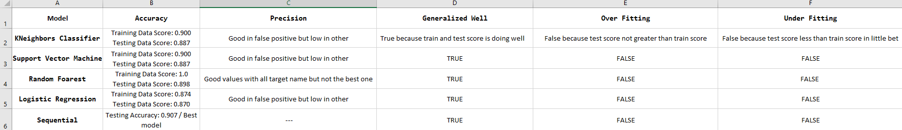

# Machine Learning Models For Supervised Learning 

Over a period of nine years in deep space, the NASA Kepler space telescope has been out on a planet-hunting mission to discover hidden planets outside of our solar system.

*  In this repo I did create machine learning models capable of classifying candidate exoplanets from the raw dataset.
* Use GridSearch to tune model parameters.

I used many models to choice the best Accuracy model based on train and test split data.

---
Models that used:
* KNeighbors Classifier.
* Support Vector Machine.
* Random Foarest.
* Logistic Regression.
* Sequential.

Based on this summary table Sequential is best model, and saved in separeate file `haifa.h5`.

## future work:

Addressing the imbalance data using one of the sampling techniques such as :
* Upsampling or downsampling. 
* Apply other machine learning algo to address the given problem.

using differnt matrices to evaluate our work like ROC, AUC, sapceficyty and senstiveity.
